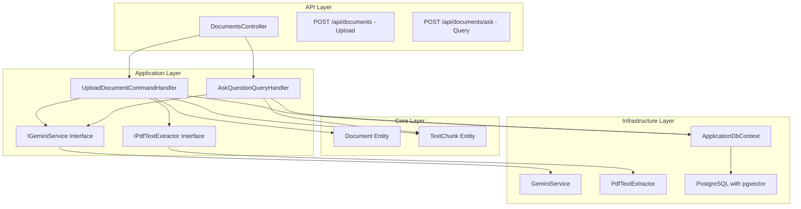
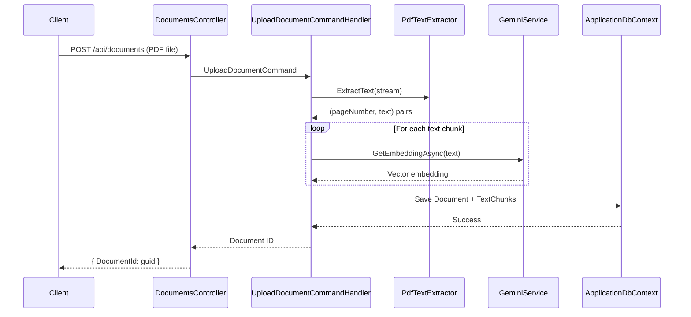
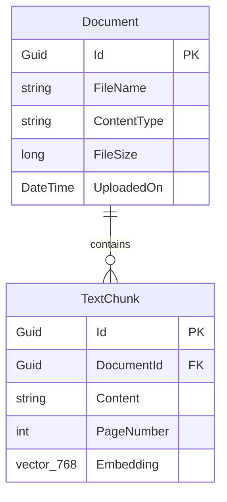
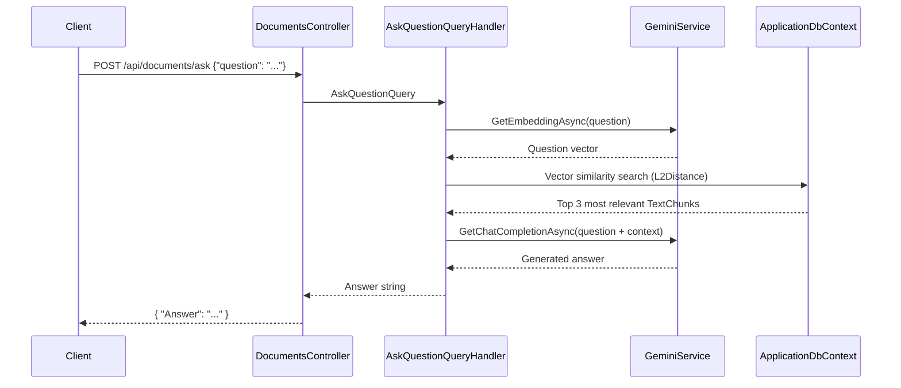
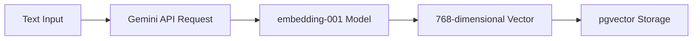
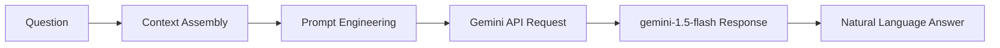
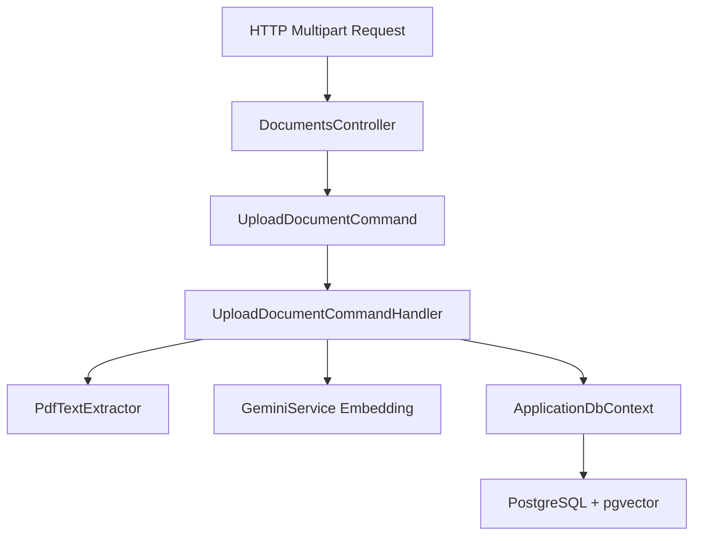
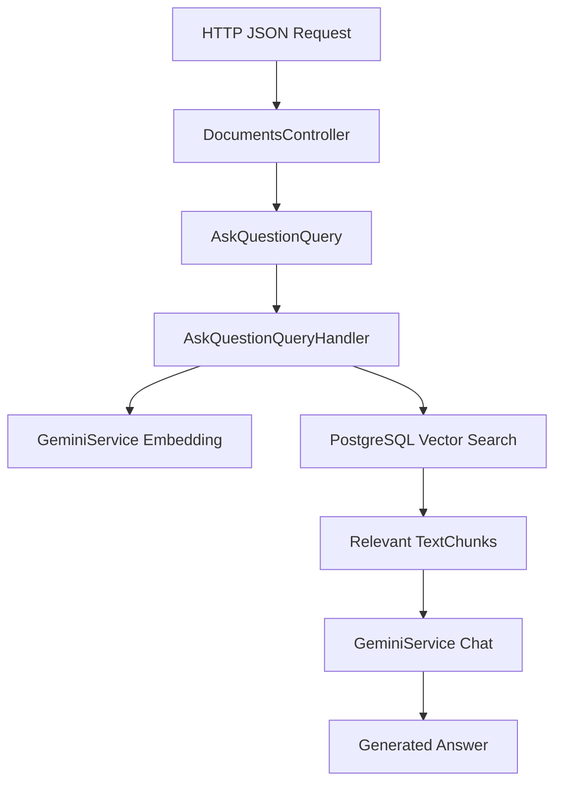

# NacresKnowledgeBase: File-Based Question Answering System

## Overview

NacresKnowledgeBase is an AI-powered document management and question-answering system that enables users to upload PDF documents and ask natural language questions about their content. The system leverages Google's Gemini AI for both text embeddings and conversational responses, implementing a Retrieval-Augmented Generation (RAG) architecture to provide accurate, context-aware answers.

## Architecture

The system follows Clean Architecture principles with clear separation of concerns across four distinct layers:



### Layer Responsibilities

| Layer              | Components                                 | Purpose                                                   |
| ------------------ | ------------------------------------------ | --------------------------------------------------------- |
| **API**            | DocumentsController                        | HTTP endpoint exposure, request/response handling         |
| **Application**    | Command/Query Handlers, Service Interfaces | Business logic orchestration, CQRS pattern implementation |
| **Core**           | Document, TextChunk entities               | Domain model definition                                   |
| **Infrastructure** | GeminiService, PdfTextExtractor, DbContext | External service integrations, data persistence           |

## Document Upload and Processing Workflow

The document upload process consists of several key stages that prepare documents for intelligent querying:



### Processing Steps Detail

1. **File Reception**: DocumentsController receives IFormFile through HTTP POST
2. **Document Creation**: Handler creates Document entity with metadata (filename, size, upload time)
3. **Text Extraction**: PdfTextExtractor (using PdfPig library) extracts text page by page
4. **Text Chunking**: Each page becomes a separate TextChunk with associated page number
5. **Embedding Generation**: Each text chunk is converted to 768-dimensional vector using Gemini embedding-001 model
6. **Persistence**: Document and TextChunks (with embeddings) are saved to PostgreSQL with pgvector extension

### Data Model



## Question Answering Mechanism

The question answering system implements a sophisticated RAG (Retrieval-Augmented Generation) approach:



### Semantic Search Process

1. **Question Vectorization**: User's question is converted to embedding vector using same Gemini model
2. **Similarity Search**: PostgreSQL pgvector performs L2 distance calculation against all stored embeddings
3. **Relevance Ranking**: System retrieves top 3 most semantically similar text chunks
4. **Context Assembly**: Selected chunks are concatenated with separators to form context
5. **Answer Generation**: Gemini generates response based on question + assembled context

### Vector Similarity Mathematics

The system uses L2 (Euclidean) distance for vector similarity:

```
L2Distance(v1, v2) = √(Σ(v1[i] - v2[i])²)
```

Lower distances indicate higher semantic similarity. The `OrderBy(c => c.Embedding!.L2Distance(questionEmbedding))` ensures most relevant chunks are selected first.

## API Endpoints Reference

### Upload Document

```http
POST /api/documents
Content-Type: multipart/form-data

Form Data:
- file: PDF file (IFormFile)

Response:
{
  "DocumentId": "550e8400-e29b-41d4-a716-446655440000"
}
```

### Ask Question

```http
POST /api/documents/ask
Content-Type: application/json

{
  "Question": "What is the main topic of the document?"
}

Response:
{
  "Answer": "Based on the document content, the main topic is..."
}
```

## Technology Stack & Dependencies

| Component             | Technology                   | Version                 | Purpose                              |
| --------------------- | ---------------------------- | ----------------------- | ------------------------------------ |
| **Framework**         | ASP.NET Core                 | -                       | Web API foundation                   |
| **ORM**               | Entity Framework Core        | -                       | Database access layer                |
| **Database**          | PostgreSQL + pgvector        | -                       | Vector storage and similarity search |
| **AI Service**        | Google Gemini API            | gemini-1.5-flash-latest | Text generation and embeddings       |
| **PDF Processing**    | UglyToad.PdfPig              | -                       | PDF text extraction                  |
| **CQRS**              | MediatR                      | -                       | Command/Query pattern implementation |
| **Vector Operations** | Pgvector.EntityFrameworkCore | -                       | Vector database operations           |

## Business Logic Layer Architecture

### Command Pattern Implementation

The upload workflow uses CQRS command pattern:

```csharp
// Command Definition
public class UploadDocumentCommand : IRequest<Guid>
{
    public IFormFile File { get; set; } = null!;
}

// Handler Implementation
public class UploadDocumentCommandHandler : IRequestHandler<UploadDocumentCommand, Guid>
{
    // Dependencies: IApplicationDbContext, IGeminiService, IPdfTextExtractor
    // Process: Extract → Embed → Persist
}
```

### Query Pattern Implementation

The question answering uses CQRS query pattern:

```csharp
// Query Definition
public class AskQuestionQuery : IRequest<string>
{
    public string Question { get; set; } = string.Empty;
}

// Handler Implementation
public class AskQuestionQueryHandler : IRequestHandler<AskQuestionQuery, string>
{
    // Process: Vectorize → Search → Generate → Return
}
```

## AI Integration Architecture

### Gemini Service Capabilities

| Method                   | Model                   | Input              | Output                    | Purpose                 |
| ------------------------ | ----------------------- | ------------------ | ------------------------- | ----------------------- |
| `GetEmbeddingAsync`      | embedding-001           | Text string        | 768-dim vector            | Semantic representation |
| `GetChatCompletionAsync` | gemini-1.5-flash-latest | Question + Context | Natural language response | Answer generation       |

### Embedding Process Flow



### Chat Completion Process Flow



## Data Flow Between Layers

### Upload Data Flow



### Query Data Flow



## Error Handling and Edge Cases

### Upload Error Scenarios

| Scenario                  | Response            | HTTP Status               |
| ------------------------- | ------------------- | ------------------------- |
| No file provided          | "No file uploaded." | 400 Bad Request           |
| Invalid PDF format        | PdfPig exception    | 500 Internal Server Error |
| Gemini API failure        | Service exception   | 500 Internal Server Error |
| Database connection issue | EF Core exception   | 500 Internal Server Error |

### Query Error Scenarios

| Scenario                 | Response                                                    | Behavior                    |
| ------------------------ | ----------------------------------------------------------- | --------------------------- |
| No relevant chunks found | "Üzgünüm, bu soruya cevap verebilecek bir bilgi bulamadım." | Graceful fallback           |
| Gemini API error         | "Error from Gemini API: {status} - {content}"               | Error transparency          |
| Empty question           | Processed normally                                          | May return generic response |

## Testing Strategy

### Unit Testing Areas

1. **Command/Query Handlers**

   - Mock dependencies (IGeminiService, IPdfTextExtractor, IApplicationDbContext)
   - Test business logic isolation
   - Verify proper entity creation and persistence calls

2. **Service Implementations**

   - Test PdfTextExtractor with various PDF formats
   - Mock GeminiService HTTP calls
   - Verify vector operations and database queries

3. **Entity Behavior**
   - Test Document and TextChunk property assignments
   - Verify navigation property relationships
   - Test vector embedding storage and retrieval

### Integration Testing Areas

1. **End-to-End Workflows**

   - Full upload → extract → embed → persist flow
   - Complete question → search → generate → respond flow
   - Database transaction integrity

2. **External Service Integration**
   - Actual Gemini API calls with test data
   - PostgreSQL pgvector operations
   - PDF processing with real documents

This design document provides a comprehensive understanding of how NacresKnowledgeBase processes uploaded files and enables intelligent question-answering through advanced AI and vector search technologies.
